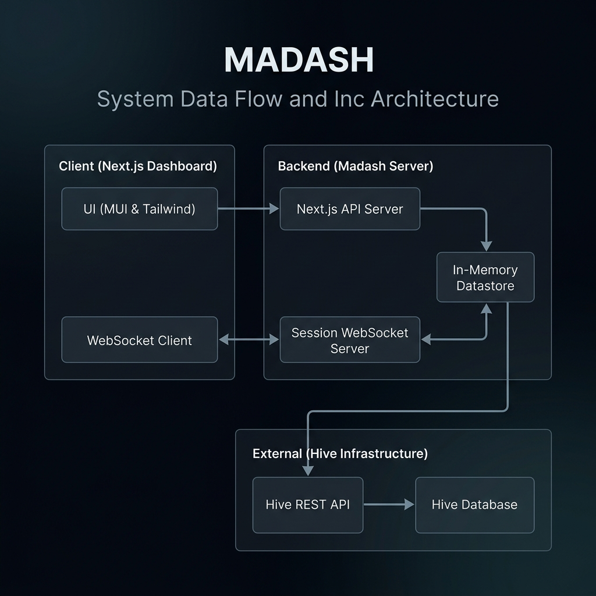

# מסמך הגדרת מוצר: מערכת מד"ש (MADASH)

## 1. תקציר מנהלים
מערכת **מד"ש (Madrat & Mevuzarim Dashboard)** היא מערכת שו"ב בזמן אמת, שנועדה לייעל ולרכז את ניהול שגרת היום, הלוגיסטיקה והזימונים במערך הבי"ס. 

המערכת משמשת כמסך העבודה המרכזי של **המדר"ת** (מדריך תורן) ומספקת תמונה אחת ברורה (Single Source of Truth) המחברת בין נתוני הפעילות הלימודית לבין הפעילודת המנהלתית של החניכים בכיתות. 

בעזרת סנכרון נתונים מיידי, מד"ש מאפשרת לסגל לנהל משימות מנהלתיות, לעקוב אחר עומסי תמיכה בלימודים (הלפים בהייב), לנהל זימונים לרופא ולקב"ן ושאר הזימונים הרגישים, ולזמן חניכים לחד"ס בצורה שקופה, מהירה ונטולת ניירות או פתקים.

---

## 2. האתגרים המבצעיים והמענה המערכתי

|                                                                                                                                                                                    האתגר בשגרת ההכשרה |                                                                                                                          המענה במערכת מד"ש |
| ----------------------------------------------------------------------------------------------------------------------------------------------------------------------------------------------------: | -----------------------------------------------------------------------------------------------------------------------------------------: |
|                                                                 **חוסר מעקב אחר חניכים שזומנו חד"ס:** חניך אמור להגיע לחד"ס ואין מקור אמת אחוד שאומר האם קראו לו, האם הוא הגיע, ולמה בכלל נקרא לחד"ס. |                              **לוח קריאות מנוהל (קריאה לחד"ס):** מעקב חזותי בזמן אמת אחר סטטוס החניך מרגע זימונו ועד לאחר הגעתו לחדר הסגל. |
| **פספוס זימונים למרפאה ולקב"ן בבסיס:** זימונים רפואיים ופגישות קב"ן המנוהלים בקבוצות וואטסאפ או פתקים פיזיים נוטים להתפספס, דבר הפוגע בבריאות החניך ובשגרת ההכשרה, וכיום מוביל למשפט אצל מפקדת הבסיס. | **לוח זימונים ונעיצות (Pinned Messages):** אזור ייעודי ובולט המרכז את כל הטיפולים הרפואיים והקב"ן המתוכננים לאותו יום כדי לוודא הגעה בזמן. |
|                                                                        **חוסר מודעות לעומס לימודי בכיתות:** קושי של המפקדים לזהות בזמן אמת מתי חניכים מתקשים במשימות ומתי נדרשת הזרמת מדריכים לתגבור. |            **מדד העומס הלימודי (Helps Gauge):** מחוון חזותי המציג את יחס בקשות העזרה הלימודיות הפתוחות לעומת כמות החניכים בכיתות בזמן אמת. |
|                                                                 **חפיפת מדר"ת (מדריך תורן) מסורבלת:** קושי במעקב אחר משימות מנהלתיות יומיות (זימונים, מסדרי נוכחות וניקיון) ומעבר לא מסודר של משמרות. |             **יומן מדר"ת דיגיטלי:** צ'קליסט יומי מתוזמן ומסונכרן המאפשר סימון ביצוע, מעקב סטטוס ונעילת נתונים למניעת שינויים רטרואקטיביים. |

---

## 3. תכולות פונקציונליות עיקריות

### 3.1. ניהול קריאות לחד"ס
ממשק לזימון מהיר של חניך בודד או קבוצת חניכים לחדר הסגל למטרות מוגדרות מראש.

* **בחירה חכמה:** בחירה מהירה של חניכים מתוך רשימת חניכי הקורס המעודכנת.
* **הגדרת סיבה:** הזנת סיבת הזימון (כגון: "שיחת משמעת", "בקשת יציאה", "אובדן משמר אמן").
* **הגבלת זמן פקיעה:** קביעת שעון עצר שמסמן מתי פג תוקף הקריאה כדי למנוע קריאות חוזרות של אותו החניך מאותה הסיבה.
* **מעקב סטטוס ברור:** תצוגה חזותית המשתנה  מסטטוס "נשלח זימון" (כתום מהבהב) לסטטוס "הגיע" (ירוק יציב) ברגע שהחניך מתייצב.

### 3.2. ריכוז ונעיצת זימונים רגישים (רפואי וקב"ן)
אזור ייעודי המציג לסגל בצורה בולטת ומאובטחת את תנועת החניכים למתקנים רפואיים וטיפוליים מחוץ לכיתה.

* **נעיצת מועדי יציאה:** אפשרות לנעיצת הודעות מפקד מיוחדות המפרטות מועדי הסעות למרפאות ופגישות קב"ן מתוכננות, כדי למנוע היעדרויות בלתי מתואמות.
* **סנכרון הקלות ת"ש ומשמעת:** מקום אחוד לעדכן הקלות שניתנו לחניך מסויים באופן פרטני, כגון פטור נעליים בשל פצע, או אישור לצאת מהכיתה באמצע הרצאה בשל מצב נפשי.

### 3.3. ניטור עומס לימודי בכיתות
מנגנון לקבלת החלטות מבוססת נתונים על חלוקת המדריכים בין הכיתות והחדרים המבוזרים.

* **מדד ההלפים הפתוחות:** המערכת סופרת את בקשות העזרה הלימודיות הפעילות של החניכים.
* **חיווי צבעים (רמזור):** מד העומס משנה את צבעו על פי רמות חומרה:
  - **ירוק:** עומס תקין, המדריכים בכיתה מספקים מענה מהיר.
  - **צהוב (אזהרה):** עומס בינוני (מעל 15% מהחניכים ממתינים לעזרה).
  - **אדום (עומס חריג):** עומס קיצוני (מעל 20% מהחניכים ממתינים לעזרה) המצריך התערבות מיידית של מפקד ההכשרה לוויסות כוח האדם הלימודי.

### 3.4. יומן מדר"ת
כלי לריכוז משימות מנהלתיות המבטיח שגרת יום רציפה ואחידה.

* **סדר יום דינמי:** הצגת משימות קבועות לפי שעות ביצוע מוגדרות מראש לאורך ימי השבוע (ח' בוקר, שליחת דו"ח 1 על החניכים, ח' צהריים, מסדרי ניקיון, בידול הסב"שים).
* **מעקב ביצוע:** סימון ויזואלי של משימות שבוצעו ורישום אוטומטי של שעת ביצוע המשימה.
* **מעקב היסטורי:** אפשרות קלה לראות משימות שבוצעו בימים קודמים והערות לגביהן.

---

## 4. מבנה זרימת הנתונים במערכת (System Data Flow)

התרשים הבא מתאר את ארכיטקטורת המערכת והדרך שבה מד"ש מסנכרנת את המידע בין סגל ההכשרה לבין תשתית הלמידה המרכזית (Hive) בזמן אמת:

* **סנכרון מיידי (Real-Time Sync):** כל קריאה לחד"ס או הודעת מדר"ץ מעודכנת אצל כלל המשתמשים ברמת המילי-שניה באמצעות שרת ה-WebSocket, ללא צורך בריענון דפדפן.
* **חיבור לתשתית קורס (Hive):** המערכת נשענת על הנתונים הקיימים ב-Hive (רשימות חניכים, שיוך לכיתות וכמות קריאות עזרה פתוחות) ומסתנכרנת אליהם באופן שוטף, ללא צורך בהזנה כפולה של מידע.

---

## 5. תועלת והשפעה על ההכשרה
1. **שיפור איכות ההדרכה:** מתן מענה מהיר לחניכים מתקשים באמצעות זיהוי מיידי של עומים ותקלות, ובכך מניעת פערים לימודיים.
2. **משמעת ושליטה מוגברת:** מניעת פספוס זימוני חניכים לחד"ס.
3. **צמצום ביורוקרטיה וזמן ניהולי:** מעבר מלא מפתקים פיזיים, אקסלים וקבוצות וואטסאפ ללוח מרכזי אחד המספק תמונה מיידית וברורה לכל סגל הקורס.
4. **אמינות בדיווחים:** שיפור משמעותי באיכות החפיפות בין תורנויות הסגל ויכולת הפקת לקחים מבוססת נתונים והיסטוריה.
